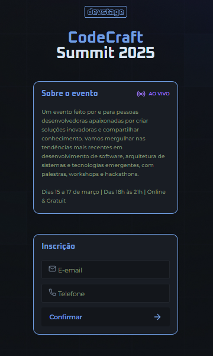
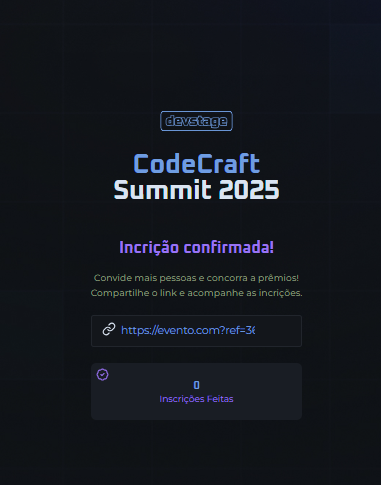

# NLW Connect
Crie um projeto em apenas três aulas gratuitas

## Tecnologias Utilizadas

- HTML (HYPERTEXT MARKUP LANGUAGE)
- CSS (CASCADING STYLE SHEET)
- JAVASCRIPT 

## Algoritmo
- Sequência de passos lógicos e finita para resolução de um problema.

## Fases da resolução de um problema
- Coletar os dados
- Processar os dados
- Apresentar os dados

## Resultado

###

